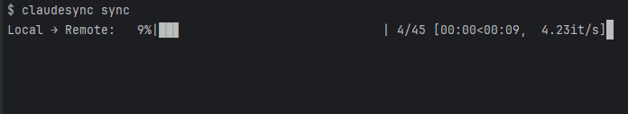

# ClaudeSync

[](https://opensource.org/licenses/MIT)
[](https://github.com/jahwag/claudesync/issues)
[](https://badge.fury.io/py/claudesync)
[](https://github.com/jahwag/claudesync/releases)
[](https://github.com/psf/black)

ClaudeSync is a powerful tool that bridges your local development environment with Claude.ai projects, enabling seamless synchronization and enhancing your AI-powered workflow.

> **⚠️ IMPORTANT DISCLAIMER:**
> 
> ClaudeSync is an independent, open-source project and is not affiliated with, endorsed by, or in any way officially connected to Anthropic or Claude.ai.
> 
> ClaudeSync's compliance with Anthropic's Terms of Service is currently under review. The use of session keys for automated access and the nature of the synchronization process may potentially violate Anthropic's TOS. We are actively seeking clarification from Anthropic on these matters.
> 
> **By using ClaudeSync, you acknowledge that:**
> 1. You are using this tool at your own risk.
> 2. Your use of ClaudeSync may potentially violate Anthropic's Terms of Service.
> 3. You are responsible for any consequences that may arise from using this tool.
> 4. ClaudeSync is not an official Anthropic product and Anthropic does not provide support for it.
>
> We recommend reviewing Anthropic's Terms of Service and Usage Policy before using ClaudeSync. We will update this disclaimer and the tool's functionality based on Anthropic's official response.



## 🌟 Key Features

- 🔄 **Real-time Synchronization**: Automatically keep your local files in sync with Claude.ai projects.
- 🚀 **Productivity Boost**: Streamline your workflow with efficient file management and reduced manual updates.
- 💻 **Cross-Platform Compatibility**: Works flawlessly on Windows, macOS, and Linux.
- 🔒 **Secure**: Prioritizes your data privacy and security.
- 🛠 **Customizable**: Configurable sync intervals, file filtering, and more.

## ⚠️ Prerequisites

**Claude Plan Requirements:**

- **Supported:** Pro, Team
- **Not Supported:** Free

## 🚀 Quick Start

1. **Install ClaudeSync:**
```shell
pip install claudesync
```

2. **Log in to your Claude.ai account:**
```shell
claudesync api login claude.ai
```

3. **Start syncing:**
```shell
claudesync project sync
```
*Note: This performs a one-way sync. Any files not present locally will be deleted from the Claude.ai Project.

📚 Need more details? Check our [Wiki](https://github.com/jahwag/claudesync/wiki) for comprehensive guides and FAQs.

## 🤝 Support ClaudeSync

Love ClaudeSync? Here's how you can contribute:

- ⭐ [Star us on GitHub](https://github.com/jahwag/claudesync)
- 🐛 [Report bugs or request features](https://github.com/jahwag/claudesync/issues)
- 🌍 [Contribute to the project](CONTRIBUTING.md)
- 💬 Join our [Discord community](https://discord.gg/pR4qeMH4u4) for discussions and support

Your support fuels ClaudeSync's growth and improvement!

---

[Contributors](https://github.com/jahwag/claudesync/graphs/contributors) • [License](https://github.com/jahwag/claudesync/blob/master/LICENSE) • [Report Bug](https://github.com/jahwag/claudesync/issues) • [Request Feature](https://github.com/jahwag/ClaudeSync/issues/new?assignees=&labels=enhancement&projects=&template=feature_request.md&title=)
