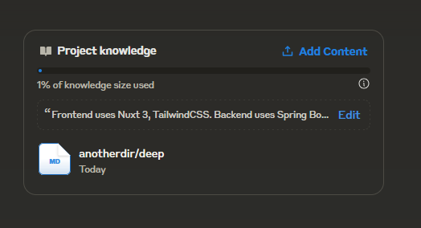

# ClaudeSync
[](https://github.com/jahwag/ClaudeSync/actions/workflows/publish-to-pypi.yml)

ClaudeSync is a Python tool that automatically synchronizes your local filesystem with Claude.ai projects.



## Installation

Install ClaudeSync using pip:

```bash
pip install claudesync
```

## Configuration

You have two options for configuring ClaudeSync:

1. Command-line arguments (recommended for one-time use or testing)
2. Configuration file (recommended for repeated use)

### Option 1: Command-line Arguments

Provide your user ID and project ID directly in the command:

```bash
claudesync --session-key YOUR_SESSION_KEY --watch-dir /path/to/watch --user-id your-user-id --project-id your-project-id
```

### Option 2: Configuration File

Create a `config.json` file in your working directory:

```json
{
    "user_id": "your-user-id-here",
    "project_id": "your-project-id-here"
}
```

Then run ClaudeSync without the `--user-id` and `--project-id` arguments:

```bash
claudesync --session-key YOUR_SESSION_KEY --watch-dir /path/to/watch
```

## Usage

### Basic Usage

```bash
claudesync --session-key YOUR_SESSION_KEY --watch-dir /path/to/watch
```

### Parameters

- `--session-key`: Your Claude.ai session key (required)
- `--watch-dir`: Directory to watch for changes (required)
- `--user-id`: User ID for Claude API (optional if in config.json)
- `--project-id`: Project ID for Claude API (optional if in config.json)
- `--delete-all`: Delete all project documents
- `--delay`: Delay in seconds before uploading (default: 5)

### Examples

Watch a directory and sync changes:
```bash
claudesync --session-key YOUR_SESSION_KEY --watch-dir /path/to/watch --user-id your-user-id --project-id your-project-id
```

Delete all documents in the project:
```bash
claudesync --session-key YOUR_SESSION_KEY --delete-all --user-id your-user-id --project-id your-project-id
```

Set a custom delay for file uploads:
```bash
claudesync --session-key YOUR_SESSION_KEY --watch-dir /path/to/watch --delay 10
```

## Features

- Watch local directories for file changes
- Automatically upload new or modified files to Claude.ai
- Delete outdated versions of files in Claude.ai
- Option to clear all documents in a Claude.ai project
- Configurable delay to prevent frequent uploads during active editing

## Development

To contribute to ClaudeSync:

1. Clone the repository:
   ```
   git clone https://github.com/jahwag/claudesync.git
   ```
2. Install development dependencies:
   ```
   pip install -r requirements.txt
   ```
3. Make your changes and test locally:
   ```
   python -m build
   pip install dist/claudesync-0.1.1-py3-none-any.whl --force-reinstall
   ```
4. Run the locally installed version:
   ```
   claudesync --help
   ```
5. Submit a pull request with your changes.

## License

[MIT License](https://opensource.org/licenses/MIT)

## Disclaimer

Ensure you have the necessary permissions to access and modify your Claude.ai projects. Keep your session key secure and do not share it publicly.